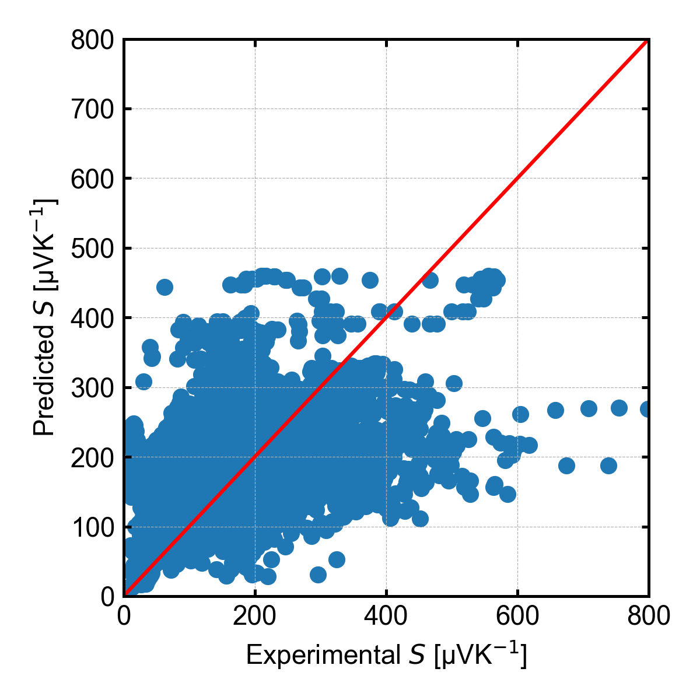
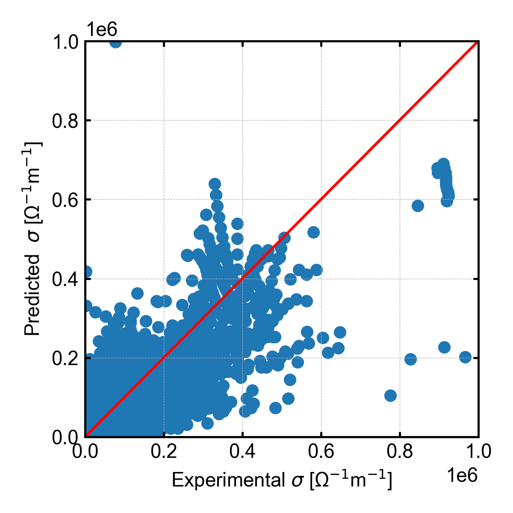
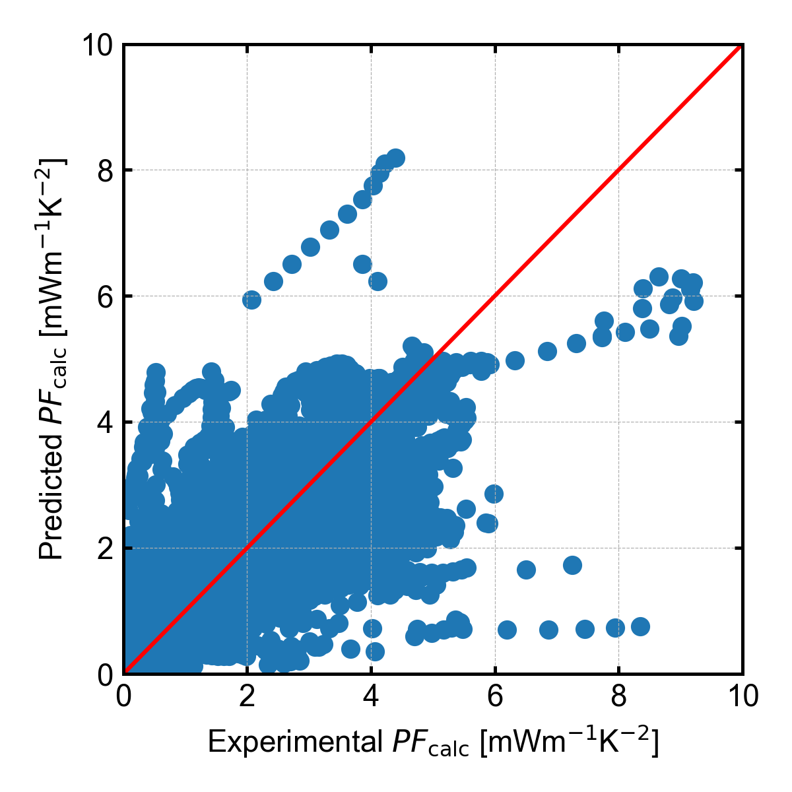
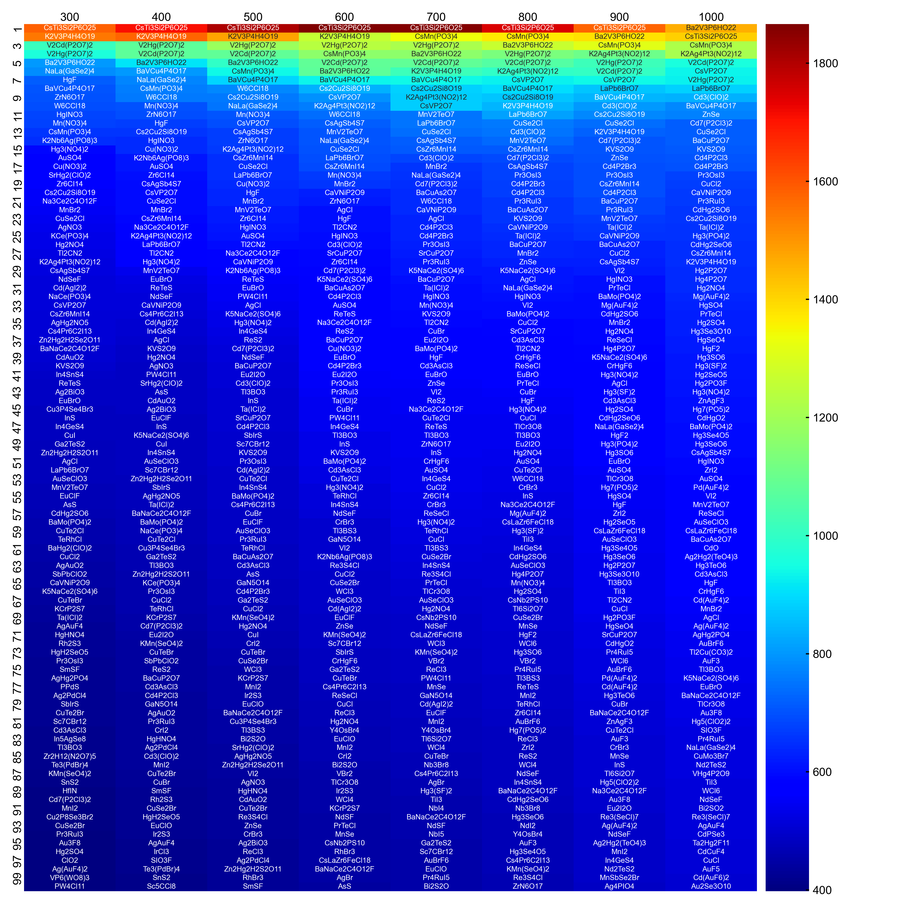
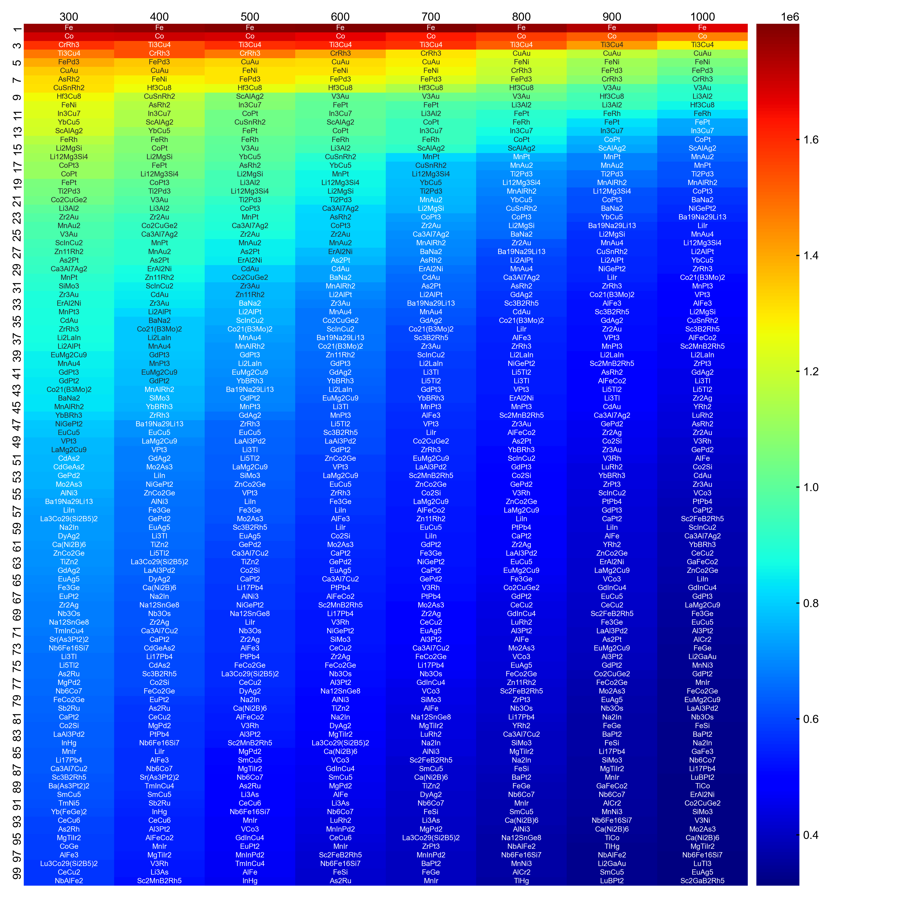
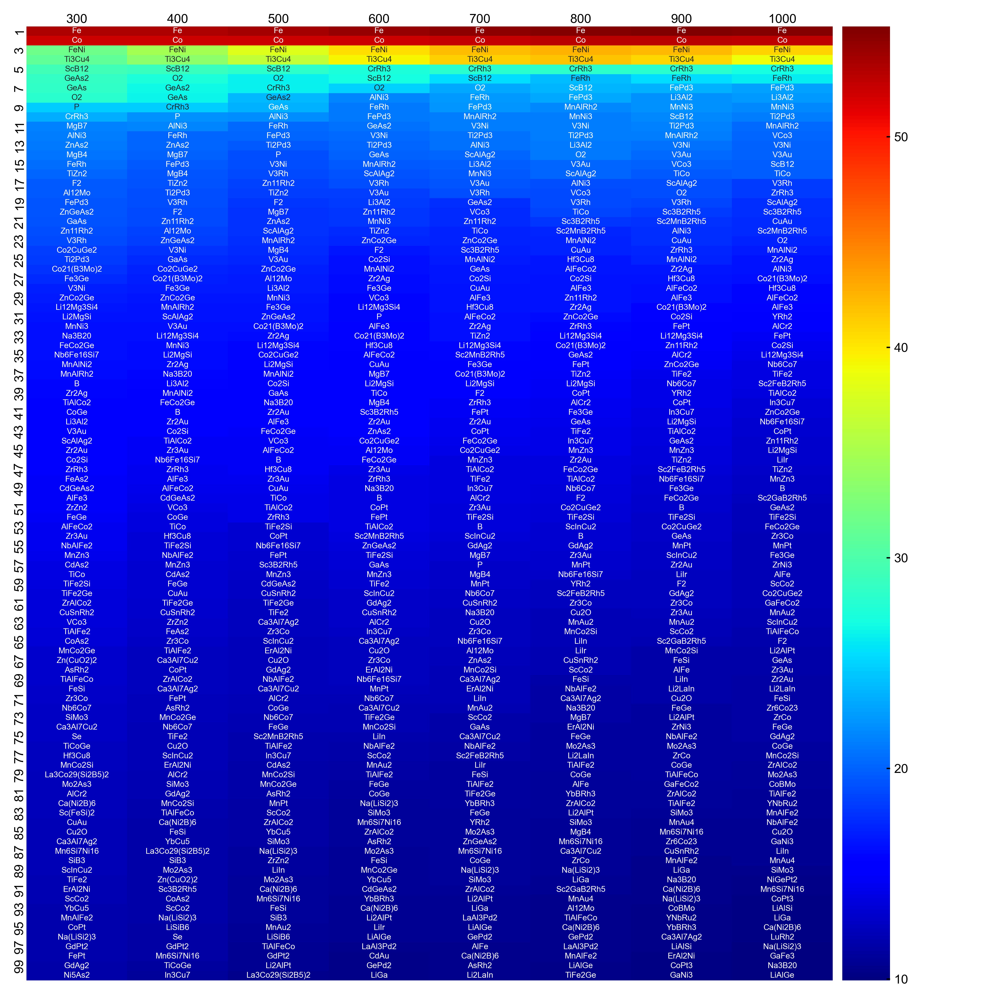
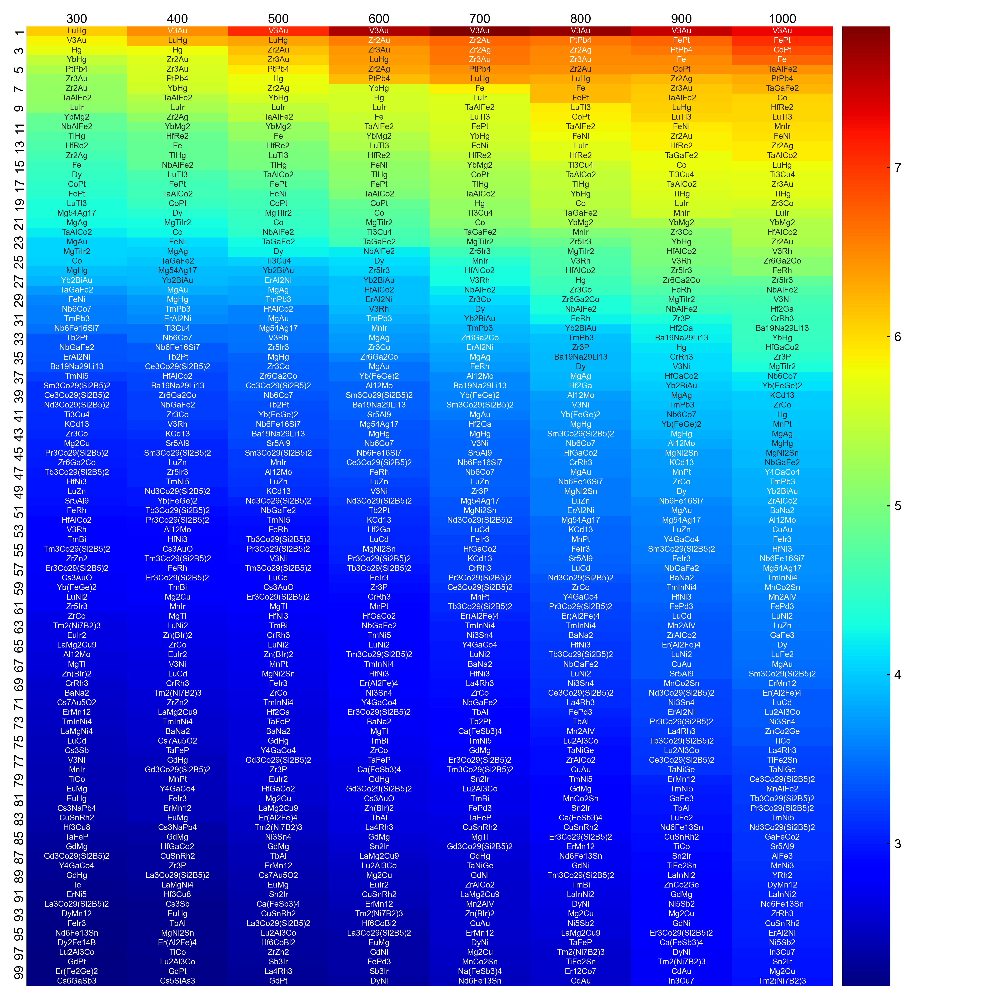
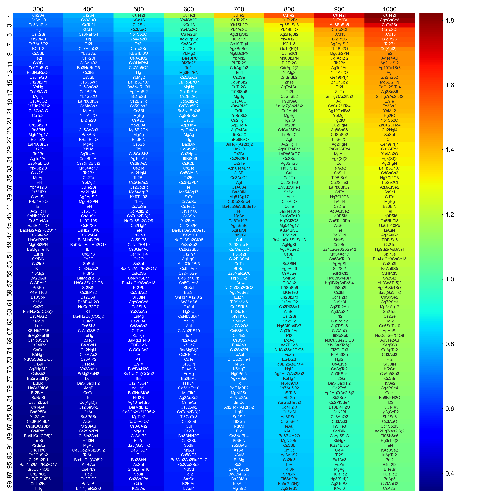

# StarryNN-TE
## Table of Contents
- [StarryNN-TE](#starrynn-te)
	- [Table of Contents](#table-of-contents)
	- [Introduction](#introduction)
	- [Prerequisites](#prerequisites)
	- [Installation](#installation)
	- [Examples](#results)
	- [How to cite](#how-to-cite)
	- [How to contribute](#how-to-contribute)
	- [Funding support](#funding-support)
	- [Author](#author)
	- [License](#license)

<a name="intro"></a>
## Introduction

<a name="prerequisites"></a>
## Prerequisites
* Docker
* Docker Compose

<a name="install"></a>
## Installation
Run the following commands in a terminal.
```sh
cd YOUR_WORKSPACE
git clone https://github.com/kumagallium/StarryNN-TE
cd StarryNN-TE
docker-compose build
docker-compose up
```

<a name="results"></a>
## Results
### Parity plots
<table>
    <tr>
        <td></td>
        <td></td>
        <td></td>
    </tr>
    <tr>
        <td></td>
        <td></td>
        <td></td>
    </tr>
</table>

### Prediction table
<table>
    <tr>
        <td></td>
        <td></td>
        <td></td>
    </tr>
    <tr>
        <td></td>
        <td></td>
    </tr>
</table>


<a name="cite"></a>
## How to cite


<a name="contrib"></a>
## How to contribute
1. Fork it (`git clone https://github.com/kumagallium/StarryNN-TE`)
2. Create your feature branch (`git checkout -b your-new-feature`)
3. Commit your changes (`git commit -am 'feat: add some feature'`)
4. Push to the branch (`git push origin your-new-feature`)
5. Create a new Pull Request
   
<a name="fund"></a>
## Funding support

<a name="author"></a>
## Author
This software was primarily written by Assistant Professor Masaya Kumagai at Kyoto University. 

<a name="license"></a>
## License
This codes are released under the MIT License.